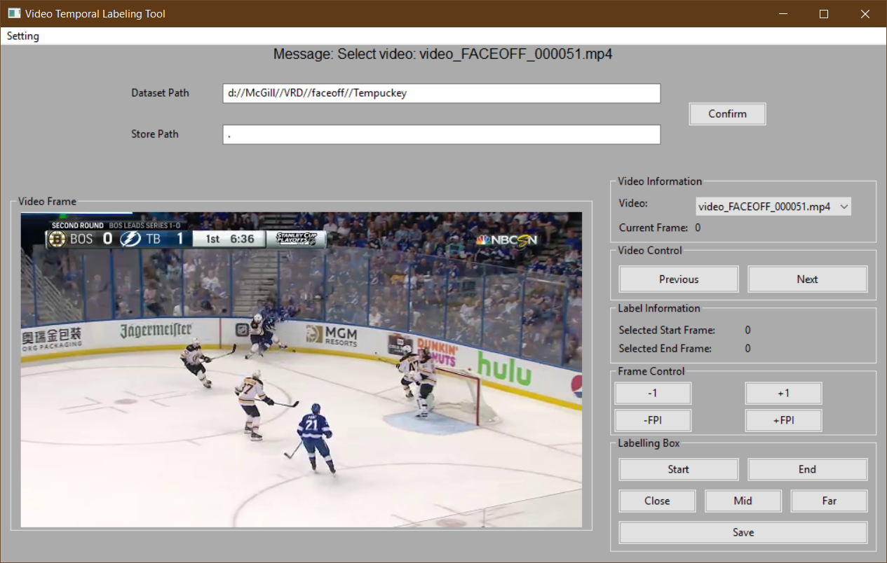

# Video Temporal Labeling Tools  
This is the repo for temporal video data labeling. It would record temporal labels for video and store the corresponding start and end frame index.  


## Required Package  
> Python == 3.7.0  
> wxpython == 4.0.7.post2  
> pandas == 0.25.3  
> opencv-python == 4.2.0.32  

## Get Started    
```bash
# clone the repo
git clone git@github.com:Catosine/VideoTemporalLabelingTool.git

# go to directory
cd VideoTemporalLabelingTool

# install required packages
pip install -r requirements.txt

# or you may go with simple version
pip install wxpython
pip install pandas
pip install opencv-python

# run the code
python3 app.py
```

## License  
This repo is under the MIT license.  
